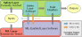

# Synergistic Simplex

Code and evaluation setup for **"Synergistic Simplex: Cooperative Runtime Assurance for Safety-Critical Autonomous Systems"**, accepted at IEEE ISSRE 2026.

Ayoosh Bansal\*, Mikael Yeghiazaryan\*, Artyom Khachatryan, Tianyi Zhu, Hunmin Kim, Naira Hovakimyan, Lui Sha
(\*Equal contribution)

  

<em>The ML Layer executes the mission and the Safety Layer enforces deterministic guardrails. SS adds two cooperation links — ML-to-Safety (M2S) and Safety-to-ML (S2M) — between the layers.</em>

## Status

🚧 This repository is a placeholder. Code and the evaluation setup are being cleaned up for release and will be published here soon.